stm32F407 USB-OTG-HS U-disk
===


## RT-Thread Studio

---

1. New >> RT-Thread Protect  

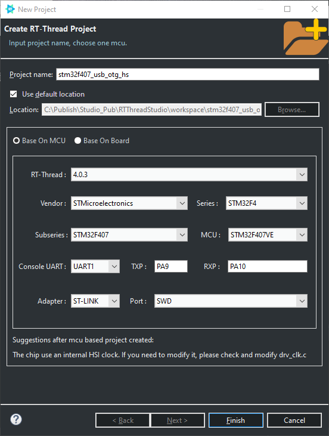.


## CubeMX Settings

---

1. System Core >> RCC >> HSE >> Crystal(外部晶振)  
2. System Core >> SYS >> Debug(选择调试接口)   
3. Connectivity >> USART1 >> Asynchronous(用于finsh命令行)  
4. Connectivity >> USB_OTG_HS >> Host_Only(开发板无供电控制故未勾选VBUS)  

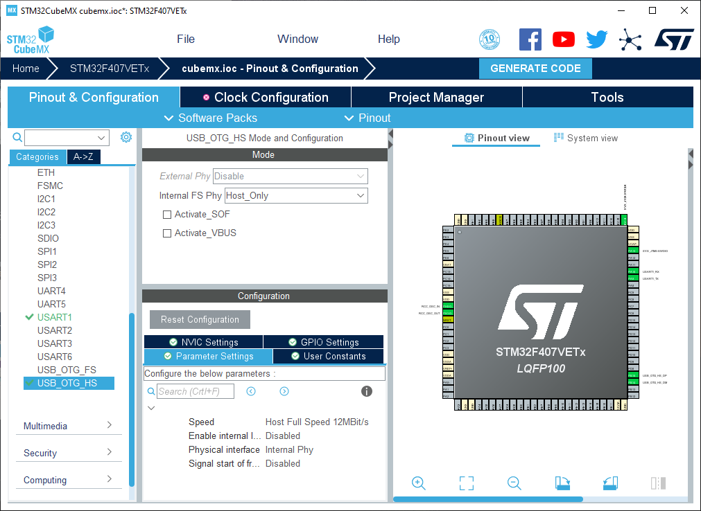

5. Enable HS global interrupt

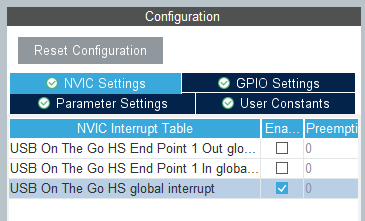

6. Clock Configuration(配置时钟)

   HCLK >> 168  >> Enter

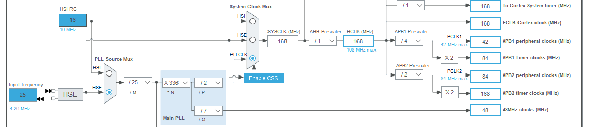

7. GENERATE COED (default seting)

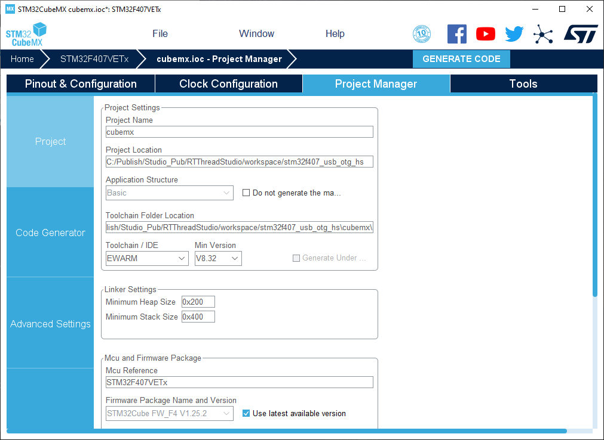

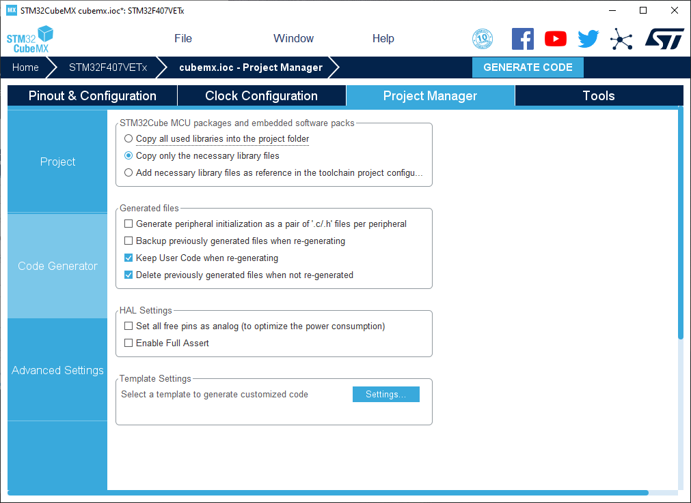


## Code

---

1. *applications/main.c*

```c
#define DBG_TAG "main"
//#define DBG_LVL DBG_INFO
#define DBG_LVL DBG_INFO
#include <rtdbg.h>
```

2. *drivers/board.h*

```c
#define BSP_USING_UART1
#define BSP_UART1_TX_PIN       "PA9"
#define BSP_UART1_RX_PIN       "PA10"

#define BSP_USING_USBHOST
#define BSP_USBD_TYPE_HS
```

3. *drivers/drv_clk.c* (copy from *cubemx/Src/main.c*)

```c
void SystemClock_Config(void)
{
  RCC_OscInitTypeDef RCC_OscInitStruct = {0};
  RCC_ClkInitTypeDef RCC_ClkInitStruct = {0};

  /** Configure the main internal regulator output voltage
  */
  __HAL_RCC_PWR_CLK_ENABLE();
  __HAL_PWR_VOLTAGESCALING_CONFIG(PWR_REGULATOR_VOLTAGE_SCALE1);
  /** Initializes the RCC Oscillators according to the specified parameters
  * in the RCC_OscInitTypeDef structure.
  */
  RCC_OscInitStruct.OscillatorType = RCC_OSCILLATORTYPE_HSE;
  RCC_OscInitStruct.HSEState = RCC_HSE_ON;
  RCC_OscInitStruct.PLL.PLLState = RCC_PLL_ON;
  RCC_OscInitStruct.PLL.PLLSource = RCC_PLLSOURCE_HSE;
  RCC_OscInitStruct.PLL.PLLM = 25;
  RCC_OscInitStruct.PLL.PLLN = 336;
  RCC_OscInitStruct.PLL.PLLP = RCC_PLLP_DIV2;
  RCC_OscInitStruct.PLL.PLLQ = 7;
  if (HAL_RCC_OscConfig(&RCC_OscInitStruct) != HAL_OK)
  {
    Error_Handler();
  }
  /** Initializes the CPU, AHB and APB buses clocks
  */
  RCC_ClkInitStruct.ClockType = RCC_CLOCKTYPE_HCLK|RCC_CLOCKTYPE_SYSCLK
                              |RCC_CLOCKTYPE_PCLK1|RCC_CLOCKTYPE_PCLK2;
  RCC_ClkInitStruct.SYSCLKSource = RCC_SYSCLKSOURCE_PLLCLK;
  RCC_ClkInitStruct.AHBCLKDivider = RCC_SYSCLK_DIV1;
  RCC_ClkInitStruct.APB1CLKDivider = RCC_HCLK_DIV4;
  RCC_ClkInitStruct.APB2CLKDivider = RCC_HCLK_DIV2;

  if (HAL_RCC_ClockConfig(&RCC_ClkInitStruct, FLASH_LATENCY_5) != HAL_OK)
  {
    Error_Handler();
  }
}

//void system_clock_config(int target_freq_mhz)
//{
//...
//}
```

4. new source file  

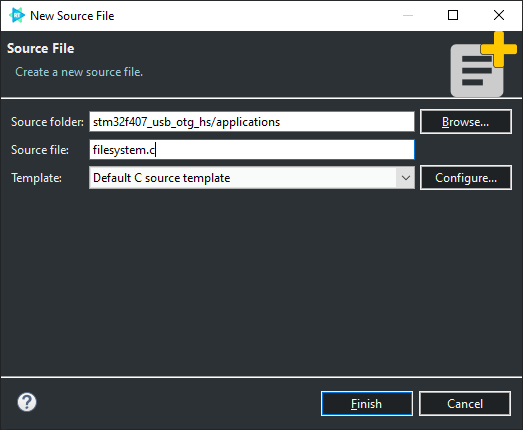

5. `applications/filesystem.c`

```C
#include <rtthread.h>
#include <dfs_fs.h>
#include "dfs_romfs.h"

#define DBG_TAG "app.filesystem"
#define DBG_LVL DBG_INFO
#include <rtdbg.h>

static const struct romfs_dirent _romfs_root[] = {
    {ROMFS_DIRENT_DIR, "udisk", RT_NULL, 0}
};

const struct romfs_dirent romfs_root = {
    ROMFS_DIRENT_DIR, "/", (rt_uint8_t *)_romfs_root, sizeof(_romfs_root) / sizeof(_romfs_root[0])
};

int mount_init(void)
{
    if (dfs_mount(RT_NULL, "/", "rom", 0, &(romfs_root)) != 0)
    {
        LOG_E("rom mount to '/' failed!");
        return RT_ERROR;
    }
    return RT_EOK;
}
INIT_APP_EXPORT(mount_init); 
```

6. drivers/drv_common.c

[STM32F407遇到USB读取U盘无法读取问题](https://club.rt-thread.org/ask/question/427531.html)

```C
void HAL_Delay(__IO uint32_t Delay)
{
    rt_thread_mdelay(Delay);
}
```

7. drivers/drv_usbh.c

```c
#define DBG_TAG "drv_usbh"
#define DBG_LVL DBG_LOG
#include <rtdbg.h>

/* add OTG_HS_IRQ */
void OTG_HS_IRQHandler(void)
{
    rt_interrupt_enter();
    HAL_HCD_IRQHandler(&stm32_hhcd_fs);
    rt_interrupt_leave();
}

/* cubemx/Src/main.c >> static void MX_USB_OTG_HS_HCD_Init(void) */
#ifdef BSP_USBD_TYPE_HS
static rt_err_t stm32_hcd_init(rt_device_t device)
{
    HCD_HandleTypeDef *hhcd = (HCD_HandleTypeDef *)device->user_data;
    hhcd->Instance = USB_OTG_HS;
    hhcd->Init.Host_channels = 12;
    hhcd->Init.speed = HCD_SPEED_FULL;
    hhcd->Init.dma_enable = DISABLE;
    hhcd->Init.phy_itface = USB_OTG_EMBEDDED_PHY;
    hhcd->Init.Sof_enable = DISABLE;
    hhcd->Init.low_power_enable = DISABLE;
    hhcd->Init.vbus_sensing_enable = DISABLE;
    hhcd->Init.use_external_vbus = DISABLE;
    RT_ASSERT(HAL_HCD_Init(hhcd) == HAL_OK);
    HAL_HCD_Start(hhcd);
#ifdef USBH_USING_CONTROLLABLE_POWER
    rt_pin_mode(USBH_POWER_PIN, PIN_MODE_OUTPUT);
    rt_pin_write(USBH_POWER_PIN, PIN_LOW);
#endif
    return RT_EOK;
}

#else

static rt_err_t stm32_hcd_init(rt_device_t device)
{
    HCD_HandleTypeDef *hhcd = (HCD_HandleTypeDef *)device->user_data;
    hhcd->Instance = USB_OTG_FS;
    hhcd->Init.Host_channels = 8;
    hhcd->Init.speed = HCD_SPEED_FULL;
    hhcd->Init.dma_enable = DISABLE;
    hhcd->Init.phy_itface = HCD_PHY_EMBEDDED;
    hhcd->Init.Sof_enable = DISABLE;
    RT_ASSERT(HAL_HCD_Init(hhcd) == HAL_OK);
    HAL_HCD_Start(hhcd);
#ifdef USBH_USING_CONTROLLABLE_POWER
    rt_pin_mode(USBH_POWER_PIN, PIN_MODE_OUTPUT);
    rt_pin_write(USBH_POWER_PIN, PIN_LOW);
#endif
    return RT_EOK;
}
#endif
```


## RT-Thread Settings
---

1. Exclude from Build

~~cubemx/Src/main.c~~  
~~cubemx/Src/stm32f4xx_it.c~~  

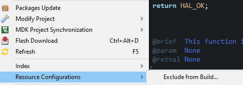

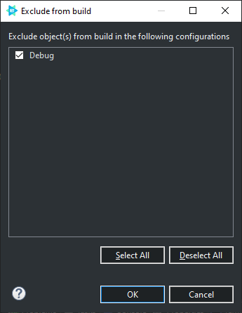

2. Components >> Device Drivers >> Using USB >> Using USB host >> Enable Udisk Drivers >> Udisk mount dir >> /udisk

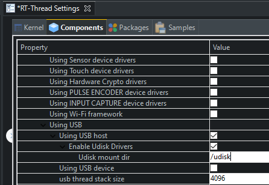

3. Components >> Device virtual file system >> Using device virtual file system >> Enable elm-chan fatfs  /  Enable ReadOnlay file system on flash

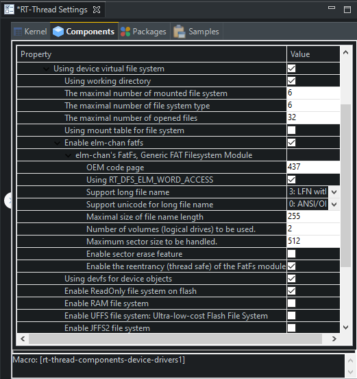

## Test

---
1. Build and Flash download
2. Terminal

<kbd>Ctrl</kbd>+<kbd>Atl</kbd>+<kbd>Shift</kbd> +<kbd>T</kbd>

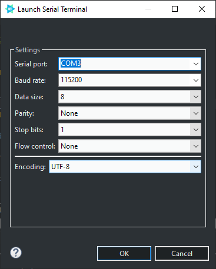

3. Insert the u-disk(插入U盘)

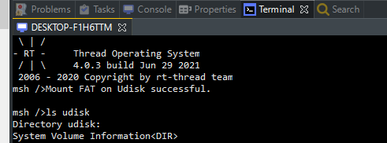

## END